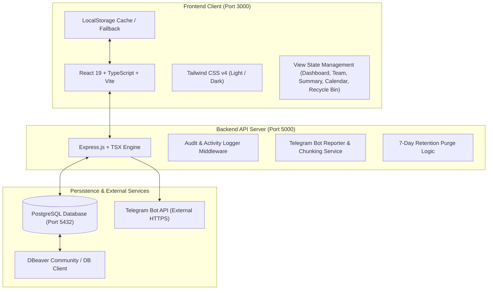
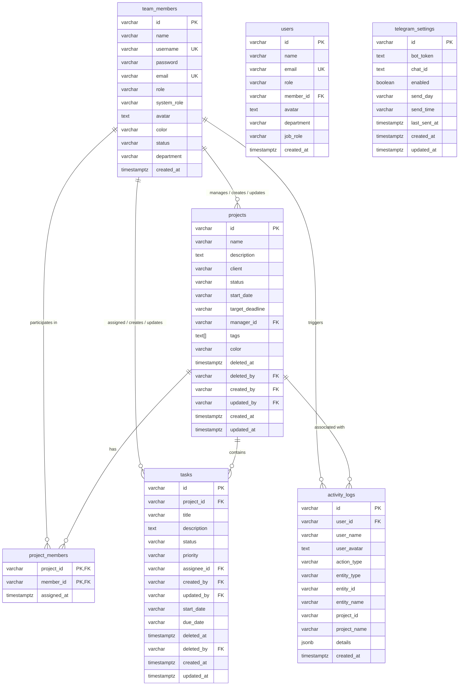

# Product Requirements Document (PRD) & System Specification

**Project Name**: UX/UI Management & Project Management Dashboard  
**Document Version**: 2.0.0  
**Status**: Approved & Implemented  
**Date**: September 2026  
**Primary Tech Stack**: React 19, TypeScript, Tailwind CSS v4, Vite, Express.js, PostgreSQL  

---

## 1. Executive Summary & Vision

### 1.1 Purpose
The **UX/UI Management Dashboard** is a centralized, high-density project management platform designed specifically for design teams, project managers, and product leads. It unifies project tracking, sprint deliverables, team resource allocation, real-time audit logging, automated weekly reporting via Telegram, and soft-delete retention into a fast, responsive, and aesthetically pleasing workspace.

### 1.2 Key Objectives
- **Portfolio Visibility**: Provide an executive birds-eye view of active projects, milestone deadlines, task bottlenecks, and team velocity.
- **Accountability & Full Audit Trail**: Ensure every project and task change is attributed to a specific team member with full creation and last-updated timestamps and user avatars.
- **Dual-Perspective Views**: Enable high-density **Table View** (default) for detailed data analysis and **Cards View** for visual sprint tracking.
- **Automated Stakeholder Communication**: Automatically compile and transmit weekly executive summaries (with ongoing, blocked, and completed deliverables) to external Telegram groups with message chunking and sanitization.
- **Real-Time Awareness**: Provide a slide-over **Team Activities Drawer** from the top navbar that streams live team updates without cluttering the main dashboard.
- **Data Protection**: Support a 7-day retention **Recycle Bin** for soft-deleted projects and tasks to eliminate accidental data loss.

---

## 2. System Architecture & Tech Stack

### 2.1 Technology Matrix
| Layer | Technologies & Libraries | Key Responsibilities |
| :--- | :--- | :--- |
| **Frontend Framework** | React 19, TypeScript, Vite | Component rendering, fast HMR, reactive state management |
| **Styling & Icons** | Tailwind CSS v4, Lucide React, Motion | Responsive design, dark mode, accessible icons, smooth GPU transitions |
| **Backend API** | Node.js, Express.js 4.x, TSX | RESTful routing, authentication validation, request audit injection |
| **Database** | PostgreSQL 12+ (tested through PG 18) | Relational storage, foreign keys, timestamps, indexes, soft-delete state |
| **Database Tooling** | `pg` connection pool, DBeaver Community | SQL migrations, ER diagram visual inspection, connection health monitoring |
| **External Integration**| Telegram Bot HTTP API | Automated project status reporting to group chats and topic threads |

---

## 3. Database Schema & Information Architecture

---

## 4. Functional Requirements by Module

### Module 1: Authentication, RBAC & Profile Management
- **Role-Based Access Control (RBAC)**:
  - `admin`: Full administrative control (create/edit/delete projects, team members, and tasks; manage system and database settings; trigger weekly reports; empty recycle bin).
  - `staff`: Team member access (update status of assigned deliverables, create tasks, view deadlines, timeline, and reports).
- **User Authentication**:
  - Direct login with email/username and password.
  - Multi-profile quick switcher for rapid testing and user demonstration.
  - State persisted securely in browser storage with request identity injection via headers (`x-user-member-id`, `x-user-name`, `x-user-avatar`).
- **Profile Self-Service**:
  - Edit personal profile details, upload/link avatar photo, update contact channels.
  - Reset password modal with current password verification.

---

### Module 2: Audit History & Change Tracking
- **Automatic Entity Attribution**:
  - All `projects` and `tasks` track `created_by`, `created_at`, `updated_by`, and `updated_at`.
  - Backend automatically extracts authenticated member ID from request headers on `POST`, `PUT`, and `PATCH` requests.
  - Preserves immutable `created_by` / `created_at` on updates while refreshing `updated_by` / `updated_at`.
- **Visual Audit Displays**:
  - **Task Modal**: Dedicated **Activity & Audit History** card displaying user avatar, full name, and human-readable timestamps (e.g., `Sep 7, 2026, 3:30 PM`).
  - **Project Detail**: Header audit strip showing creator and last modified time with photo avatar.
  - **Table View**: Inline creator attribution badges below project titles.

---

### Module 3: Portfolio & Dashboard Summary

#### 3.1 Executive Metric Cards
- **Total Projects**: Active vs total project count.
- **In Progress Tasks**: Live counter of all tasks currently in progress.
- **Blocked Deliverables**: Highlighted warning counter with rose badge for blocked tasks requiring manager intervention.
- **Completed Tasks**: Overall task completion counter against total deliverables.
- **Team Velocity**: Active team members count and animated overall completion rate progress bar (`%`).

#### 3.2 Upcoming Deadlines & Milestones
- **Auto-Sorting**: Orders all ready review, in-progress, and blocked tasks chronologically by due date.
- **Dynamic Countdown Badges**:
  - `Due Today!` (Pulse alert with rose badge).
  - `Overdue by Xd` (Critical alert with rose badge).
  - `Due in X days` (Amber if $\le 3$ days, slate if $> 3$ days).
- **Status Filters**: Quick filters for `All`, `In Progress`, `Ready Review`, and `Blocked` with inline counts.
- **Pagination**: Configurable page sizes (`6`, `12`, or `All`) with responsive pagination controls.

#### 3.3 Projects Directory
- **Status Tabs with Real-Time Counters**:
  - `All Projects (count)`
  - `In Progress (count)`
  - `Ready Review (count)`
  - `Blocked (count)` (accented in soft red pill when count $> 0$)
  - `Completed (count)`
- **Search & Filter Bar**:
  - Bottom-aligned flush with status pill container (`md:items-end`).
  - Real-time search across project names, clients, descriptions, and tags with quick clear (`X`).
- **View Mode Toggle (`[ Table ] [ Cards ]`)**:
  - Positioned directly beneath status filter tabs alongside summary label `Showing X projects`.
  - **Table View (Default)**:
    - High-density data layout displaying `# Index`, `Project Name & Client`, `Status` (with quick admin change dropdown), `Progress Bar %`, `Deliverables breakdown` (Done, Ongoing, Blocked), `Deadline`, `Team Avatars`, and `Workspace ↗` action.
  - **Cards View**:
    - Responsive 3-column grid (`grid-cols-1 md:grid-cols-2 lg:grid-cols-3`) displaying client tags, assigned member avatars, deliverable progress bars, and admin edit/delete buttons.

---

### Module 4: Project Workspace & Kanban Board
- **Project Detail Header**:
  - Color banner, client tag, manager indicator, date range, and quick status modifier.
  - Overlapping team member avatar stack with role tooltips.
- **Kanban Deliverables Board**:
  - 4 workflow columns: **In Progress**, **Ready Review**, **Blocked**, **Completed**.
  - Interactive cards showing priority pills (`Urgent`, `High`, `Medium`, `Low`), target deadlines, assignee avatars, and creator attribution.
  - Seamless status transition actions directly from cards or modal.
- **Task Modal**:
  - Full task editor with title, rich description, status dropdown, priority select, start/due dates, and team assignee selector with avatar photos.
  - Audit history card showing exact creator and last modifier.

---

### Module 5: Team Management & Directory
- **Team Roster**:
  - Member cards with avatar photo, job role, department (UX/UI, Dev, QA, PM), and status indicator (`Active`, `Busy`, `Away`).
  - Workload metrics showing number of assigned projects, active tasks, and completion rate.
- **Member Management**:
  - Admin modal to create new members or edit existing details (name, email, role, avatar upload/URL, system permissions).
  - Allocate and manage project assignments across multiple projects simultaneously.

---

### Module 6: Calendar & Timeline View
- **Multi-Week Gantt Timeline**:
  - Horizontal timeline view of all projects and deliverables mapped across active dates.
  - Visual status color bars representing active durations and target completion dates.
- **Interactive Filtering**: Filter timeline by specific project, assignee, or status.

---

### Module 7: Automated Weekly Summary & Telegram Integration
- **Project Weekly Report Generator**:
  - Generates comprehensive weekly reports (Monday to Friday format) categorized by project:
    - Project Name, Client, Target Deadline.
    - Ongoing deliverables with assigned members.
    - Blocked deliverables requiring escalation.
    - Completed deliverables accomplished during the sprint.
- **Live Telegram Bot Push**:
  - Dedicated endpoint `POST /api/telegram/send-report` sends formatted summaries directly to designated Telegram channels/groups.
  - **Smart Chunking**: Automatically breaks long reports (>3900 characters) into sequential message parts on paragraph boundaries (`\n\n`) to prevent Telegram 4096-character limit errors.
  - **HTML Sanitization**: Escapes special characters (`<`, `>`, `&`) to prevent parse mode exceptions.
- **Telegram Settings Modal**:
  - Configure Bot Token, Chat ID, and automated schedule day/time with test connection verification.

---

### Module 8: Recycle Bin & 7-Day Data Retention
- **Soft Deletion Architecture**:
  - Deleting a project or task sets `deleted_at = NOW()` and `deleted_by = currentUser.id`.
  - Excluded from all active dashboard, Kanban, and report queries.
- **Recycle Bin View & Modal**:
  - Accessible via the Navbar trash icon (with dynamic badge showing deleted item count).
  - Displays deleted items with deletion date, retention countdown (7 days until auto-purge), and deleter info.
  - Actions: **Restore Item** (recovers project/task back to active workspace), **Permanent Delete**, and **Empty Recycle Bin**.

---

### Module 9: Team Activities Slide-over Drawer
- **Navbar Integration**:
  - Dedicated `Activity` icon button with live green pulse indicator on desktop header and mobile bar.
  - Active button highlighting when drawer is open.
- **Slide-over Overlay UX**:
  - Hardware-accelerated 300ms CSS slide-in transition from right (`translate-x-full` $\rightarrow$ `translate-x-0`).
  - Darkened blurred backdrop (`backdrop-blur-xs`) that dismisses on click.
  - Dismissible via `Escape` key and locks page body scrolling while open.
- **Activity Feed Features**:
  - Auto-polls backend every 15 seconds for live team updates.
  - Filter pills: `All Activity`, `Tasks`, `Projects` with log count badge.
  - Activity cards show user avatar, action badge (`Created Task`, `Status Changed`, `Completed`, `Project Created`), and relative timestamp (`Just now`, `5m ago`, `Yesterday`).
  - Clicking a project inside the drawer automatically navigates to that project workspace and closes the drawer.

---

## 5. Non-Functional Requirements (NFRs)

| Category | Requirement | Implementation Specification |
| :--- | :--- | :--- |
| **Performance** | Sub-second initial load | Vite production bundling with Gzip compression; database queries indexed on foreign keys and timestamps (`idx_tasks_project_id`, `idx_activity_logs_created_at`). |
| **Animation & UX** | 60/120 fps fluid transitions | GPU acceleration (`transform-gpu`) for slide-over drawer; optical typography alignment in navbar; smooth dark/light theme transition. |
| **Resilience** | Offline & DB Failover | Client caches projects, tasks, and team members in `LocalStorage`. If PostgreSQL is temporarily unreachable, UI gracefully falls back to local cache and alerts user via Database Health indicator. |
| **Security** | Role & Input Validation | API validates request headers and actor roles; password management with verified resets; HTML sanitization for external messaging. |
| **Compatibility** | Cross-Browser & Device | Fully responsive design tested on desktop, tablet, and mobile; dark and light mode with system preference auto-detection. |

---

## 6. Complete API Endpoint Specification

### Core API Endpoints
| Method | Endpoint | Description | Auth / Headers |
| :--- | :--- | :--- | :--- |
| `GET` | `/api/health` | System health check, DB stats & DBeaver connection parameters | None |
| `GET` | `/api/projects` | Fetch all active projects with member IDs & creator metadata | Optional |
| `POST` | `/api/projects` | Create new project | `x-user-member-id`, `x-user-name` |
| `PUT` | `/api/projects/:id` | Update project details (name, client, dates, description, tags) | `x-user-member-id` |
| `PATCH`| `/api/projects/:id/status` | Update project status (`In Progress`, `Ready Review`, etc.) | `x-user-member-id` |
| `PATCH`| `/api/projects/:id/members`| Update project team member assignments | `x-user-member-id` |
| `DELETE`| `/api/projects/:id` | Soft-delete project (moves to Recycle Bin) | `x-user-member-id` (Admin) |
| `GET` | `/api/tasks` | Fetch all active tasks with project & assignee details | Optional |
| `POST` | `/api/tasks` | Create new task | `x-user-member-id`, `x-user-name` |
| `PUT` | `/api/tasks/:id` | Update task details (title, description, dates, priority) | `x-user-member-id` |
| `PATCH`| `/api/tasks/:id/status` | Update task status (auto-completes project if all tasks Done)| `x-user-member-id` |
| `PATCH`| `/api/tasks/:id/assignee` | Reassign task to another team member | `x-user-member-id` |
| `DELETE`| `/api/tasks/:id` | Soft-delete task (moves to Recycle Bin) | `x-user-member-id` |
| `GET` | `/api/members` | Fetch all team members with system roles & contact info | Optional |
| `POST` | `/api/members` | Create new team member | Admin |
| `PUT` | `/api/members/:id` | Update team member profile | Admin or Self |
| `DELETE`| `/api/members/:id` | Delete team member | Admin |
| `GET` | `/api/activities` | Fetch recent team activity audit logs (limit 40) | Optional |
| `GET` | `/api/recycle-bin` | Fetch soft-deleted projects & tasks with retention time left | Optional |
| `POST` | `/api/recycle-bin/restore`| Restore item from Recycle Bin back to active workspace | `x-user-member-id` |
| `POST` | `/api/recycle-bin/empty` | Permanently delete all items in Recycle Bin | Admin |
| `DELETE`| `/api/recycle-bin/:type/:id`| Permanently purge specific soft-deleted item | Admin |
| `GET` | `/api/telegram/settings`| Fetch Telegram bot configuration and status | Optional |
| `POST` | `/api/telegram/settings`| Update Telegram bot token, chat ID, and schedule | Admin |
| `POST` | `/api/telegram/test` | Test Telegram bot connection with ping message | Admin |
| `POST` | `/api/telegram/send-report`| Transmit formatted weekly project report to Telegram chat | `x-user-member-id` |
| `POST` | `/api/users/login` | Authenticate user credentials | Body `{ username/email, password }` |
| `POST` | `/api/users/reset-password`| Verify old password and set new password | `x-user-member-id` |

---

## 7. Future Product Roadmap

1. **Real-Time WebSockets**: Upgrade 15-second activity polling to instant WebSocket event dispatching for sub-second team collaboration.
2. **Figma API Integration**: Automatically link project deliverables to live Figma file frames and design component tokens.
3. **AI Sprint Summaries**: Leverage Google GenAI to synthesize deliverable blockers and generate automated retrospective reports for management.
